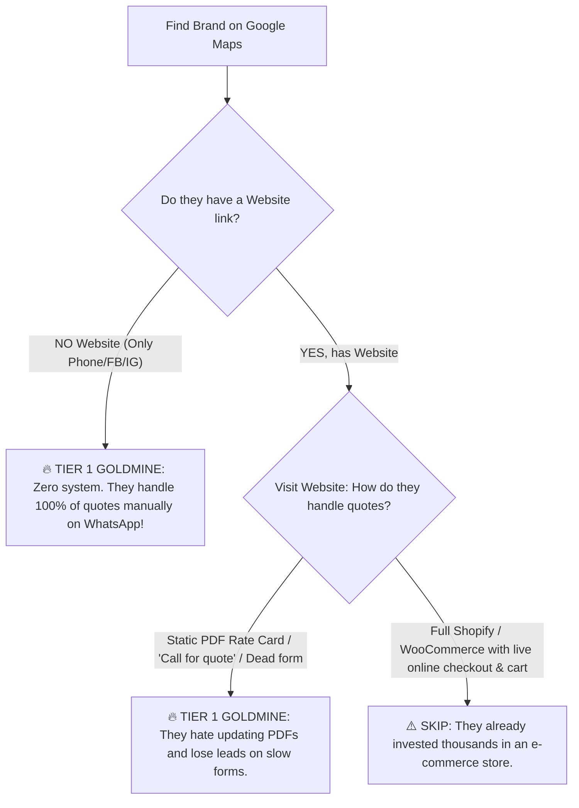

# 🎯 The Google Maps Commercial Outreach & Qualification Playbook
### *How to Audit, Qualify, Pitch, and Close 100% High-Probability Leads Without Getting Ruined by the "Photography-Only" Demo*

---

## 🚨 CRITICAL QUESTION FIRST: "Will using a photography site to pitch equipment rental or car hire ruin the deal?"

### The Honest Answer:
**YES, it will kill 80% of deals IF you just blindly say *"Look at my website."***

Here is why:
Business owners in non-photography niches (audio-visual hire, heavy camera rental, car hire, tent hire) have **zero imagination**.
If a sound engineer or fleet manager opens your link and sees:
* *"Baby Bump Photoshoot"*
* *"Boudoir Session"*
* *"Graduation Cap Retouching"*

Their immediate thought is:
> *"What does this guy want from me? This is a studio photographer trying to sell me wedding pictures. I rent out sound systems and V8s. Bye."*

---

### How to Fix This (2 Winning Strategies):

#### Strategy 1: The "Engine / Framework" Positioning (Use this TODAY without writing code)
Never send the home link `laureignstudios.vercel.app`.  
Instead, send them directly to the **Quotation Workstation Preview** or send a **15-second screen recording video**, framed with this exact script:

> *"Hey [Name], take a look at this quotation engine we engineered for a luxury studio client:*  
> *Notice how clients configure line-items, calculate add-ons in real-time, and get a tamper-proof proforma quote with official verification seals.*  
>  
> ***The engine itself is fully custom and modular.*** *We configure the exact same software for your business, swapping photo packages with your specific [Camera Gear / Sound Rigs / Executive Cars / Tents] inventory so your team stops wasting hours on WhatsApp quotes."*

When you position it as **"The Engine"**, they understand that the photography part is just the first client case study, not the limit of what the software does.

---

#### Strategy 2: The 20-Minute "Clone & Reskin" Hack (The Ultimate Weapon)
If you want a **90% response rate**, spend 20 minutes creating **ONE demo page** tailored to the sector you are pitching:
* Take [corporate-branding.html](file:///I:/packages%20website/packages/corporate-branding.html) or [index.html](file:///I:/packages%20website/packages/index.html).
* Duplicate it into `packages/gear-rental-demo.html`.
* Replace 5 photography items with:
  1. *Sony FX6 Full Cinema Package — Ksh 15,000/day*
  2. *Wireless Sennheiser Lavalier Mic Kit — Ksh 3,500/day*
  3. *Aputure 600d Pro Lighting Kit — Ksh 7,000/day*
  4. *DJI Ronin RS3 Pro Gimbal — Ksh 4,500/day*
  5. *DJI Mavic 3 Cine Drone (with Pilot) — Ksh 25,000/day*

When an equipment rental manager opens a link and sees **their actual equipment**, their jaw drops. You are no longer "a guy with a photography template"—you are **a specialized tech provider who built software for their industry.**

---

## 🔍 The 30-Second Google Maps Audit: How to Guarantee They Need This

Before you send a single message to a company on Google Maps, do this **30-second inspection** on their listing to know if they are a 100% guaranteed target:

### The 3 Signs of a "Sure-Shot" Prospect on Google Maps:
1. **The "DM for Rates / WhatsApp Only" Flag:**  
   Their Google Maps website button redirects to a WhatsApp chat (`wa.me/...`) or an Instagram profile. This means their entire quotation workflow is manual typing.
2. **The "Download Rate Card 2023.pdf" Flag:**  
   Their website has a clunky downloadable PDF that is outdated, hard to read on mobile phones, and cannot calculate totals.
3. **The "1-Star / 2-Star Quote Complaints":**  
   Check their Google Maps reviews. If clients write: *"Took 2 days to get back to me with pricing"*, you have the exact solution to pitch to the owner.

---

## 🏆 The "High-Probability" Guaranteed Targets
*(Brands that rely heavily on custom quotations, phone calls, and WhatsApp proposals)*

### 🎥 Cinema & Camera Rental Houses (High Manual Quote Bottleneck)
*These rental desks receive 30+ calls a day asking: "Do you have the FX3? How much for 3 days with 2 batteries and a 24-70mm lens?"*

1. **Hire Visual** (Karen) — Uses WhatsApp-first quote inquiries.
2. **Filmkit Company** (Kilimani) — Handles custom gear packages via inquiries.
3. **DB Studio Africa** (Nairobi) — Cinema lens & camera packages via manual booking desk.
4. **Tarf Media Equipment Hire** — Mix of self-service and manual quotes.
5. **Janeson Equipment Hire** — High lead volume, relies heavily on WhatsApp coordination.
6. **Elite Focus Gear Hire** — Multi-service, constantly sending rate cards.
7. **PTP Studios** — Studio and lighting hire via phone/WhatsApp.
8. **Maxton Media Group** — Crew + Gear quotes calculated manually.
9. **Camera Rental Kenya** (Westlands) — Freelancer and indie filmmaker gear bookings.
10. **ProGear Media Rentals** (Kilimani) — Daily gear dispatch with paper/WhatsApp rate cards.

---

### 🔊 Stage, Sound, Lighting & AV Production (The Excel Quotation Sufferers)
*These companies spend hours writing complex tenders and Excel proformas for churches, event planners, and corporate conferences.*

11. **StagePass Audio Visual** — Enterprise AV; receives constant RFQs from hotels and corporate firms.
12. **SoundFusion Limited** — Stage and sound rigs; quotes are tailored per venue size.
13. **Pneuma Audiovisuals** — Hybrid conferences, live streaming, LED screen packages.
14. **Pillar Audio Visual Services** — PA system and conference AV quotes.
15. **Neevy Entertainment** — Weddings, corporate functions, sound hire.
16. **Limelight Entertainment** — Sound, generators, and stage packages.
17. **Onyx Events AV** — Corporate presentations, projector screens, microphones.
18. **Big Five Sound & Lighting** — Outdoor concerts and brand events.
19. **Alpha Stage & Trussing Solutions** — Rigging calculations and equipment lists.
20. **Vibrations Sound & Stage** (Mombasa) — Coastal wedding & hotel gala sound setups.

---

### 🎪 Tents, Marquees, Domes & Luxury Furniture Hire (Complex Add-on Nightmare)
*Every client wants a different combination: 200 chairs, 5 tables, 1 A-frame tent, walkway carpet, fairy lights. Perfect fit for an interactive calculator.*

21. **Sherehe Events** — High-end marquee and furniture hire; manual quote requests.
22. **Amazing Theme Party Planners** — Tents and event styling packages.
23. **Events & Party Rentals Kenya** — Heavy furniture inventory; price inquiries on WhatsApp.
24. **Elite Tents Kenya** — Alpine and A-frame marquee rentals.
25. **Outdoor Occasions** — Dome tents and luxury drapes.
26. **Jambo Afrika Events** — Corporate event infrastructure.
27. **Rodmer Events & Tents** — Party setups and chair bundles.
28. **Ecoworld Events Management** — Thematic styling and furniture bundles.
29. **Boma Tents & Event Hire** — Wedding dome setups.
30. **Luxury Tents & Marquees EA** — High-ticket glass marquees; custom pricing per square meter.

---

### 🚗 Luxury Wedding & VIP Executive Car Hire (Deposit & Rate Authentication)
*They deal with Range Rovers, Land Cruisers, and Limos. Fake quotes and unauthorized brokers are a major headache in this sector.*

31. **Bamm Tours & Executive Car Hire** — High daily booking volume; handles rates manually.
32. **Go-Wheels Car Rentals & VIP Fleet** — Wedding convoys and executive chauffeur quotes.
33. **Prestige Car Hire Kenya** — S-Class and stretch limo inquiries.
34. **Ngatia Executive Car Hire** — Range Rover Vogue rentals with driver & fuel packages.
35. **Mystyle Car Hire** — Luxury SUVs for weddings and delegations.
36. **Lesus Executive** — Corporate chauffeur rates per hour/day.
37. **Barguts Tours & Wedding Cars** — Bridal car packages and escort vehicles.
38. **Royal Umbrella Cars** — VIP transport coordination.
39. **Metro Car Hire Services** — Mercedes and Prado daily quotes.
40. **Executive Limousine Kenya** — Specialty stretch limos with custom hourly tiers.

---

## 📲 The 4-Step Google Maps Outreach Protocol

### Step 1: Find the Listing on Google Maps
* Search the keyword (e.g., `Camera equipment rental Kilimani` or `Sound hire Nairobi`).
* Click the listing.
* Check the website link (Run the 30-second audit above).

### Step 2: Grab the Decision Maker's Line
* Look at the phone number on Google Maps:
  * In Kenya, 85% of Google Maps phone numbers for creative/event businesses are **direct Safaricom lines connected to WhatsApp**.
  * Save the number in your phone as: `Lead - [Company Name]`.

### Step 3: Send the Google Maps-Specific First Touch
Do NOT pitch immediately. Send this tailored curiosity hook:

> *"Hi [Company Name] team! Found your listing on Google Maps while looking at [Sound Hire / Camera Rental / Wedding Car Hire] setups in Nairobi.*  
>  
> *Quick question for the operations manager: When clients reach out asking for custom gear/package rates, are you guys still having to calculate and type out quotes by hand on WhatsApp?*  
>  
> *We developed an interactive instant proforma quotation workstation with verified company QR stamps for high-volume event & equipment businesses. Cuts quotation turnaround to 15 seconds.*  
>  
> *Would you be open to seeing a 30-second preview of how the workstation works?"*

### Step 4: When They Reply ("Sure, send it" or "How does it work?")
Send **The Framed Engine Demo**:

> *"Awesome! Here is the live production build we engineered for a high-end studio client:*  
>  
> 🔗 **https://laureignstudios.vercel.app/packages**  
>  
> *(Test clicking 'Instant Quotation Workstation' to see how the line-items calculate in real time and export an authenticated quote).*  
>  
> ***Note:** For [Prospect Company Name], we customize this exact software with your specific [sound equipment / camera inventory / vehicles / tents] so your clients or sales reps can generate branded, authenticated quotes instantly.*  
>  
> *Would you be free for a 5-minute WhatsApp call this Thursday to see what your custom inventory would look like on it?"*

---

## 💡 Summary: Why This Approach Cannot Fail
1. **You audited them first:** You only contact brands that are clearly doing quotes manually on WhatsApp or with outdated PDFs.
2. **You pre-empted the photography confusion:** You explicitly told them that the photography site is **the proof of concept/engine**, and that their version will have their exact inventory.
3. **You solved their real pain:** Saving 2 hours of manual quote calculations every single day.
